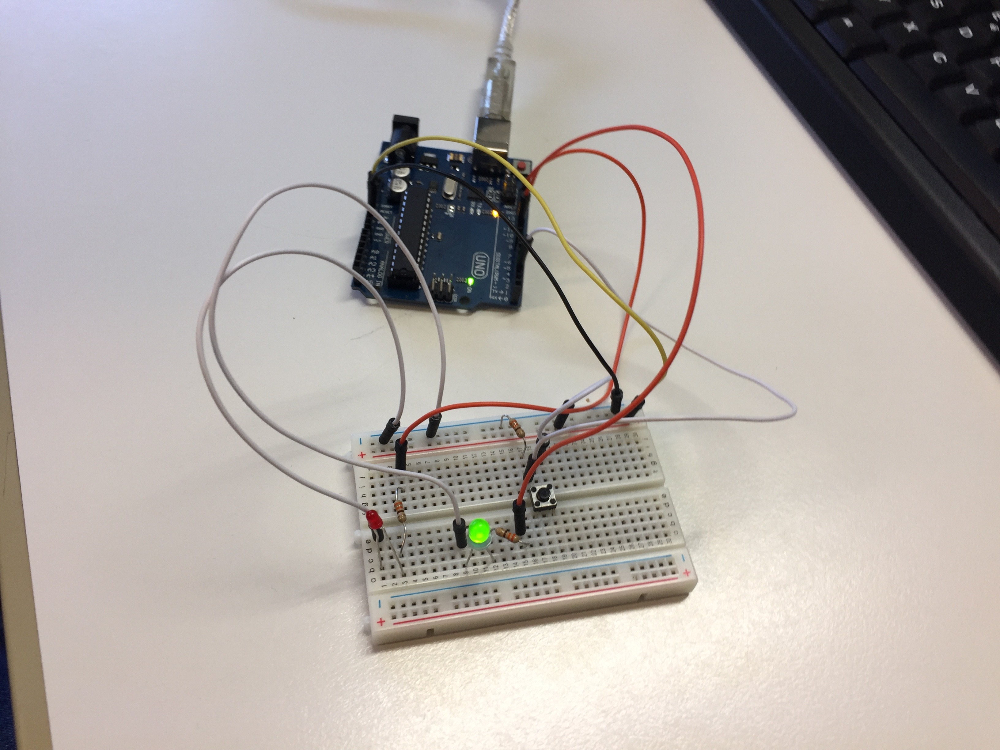
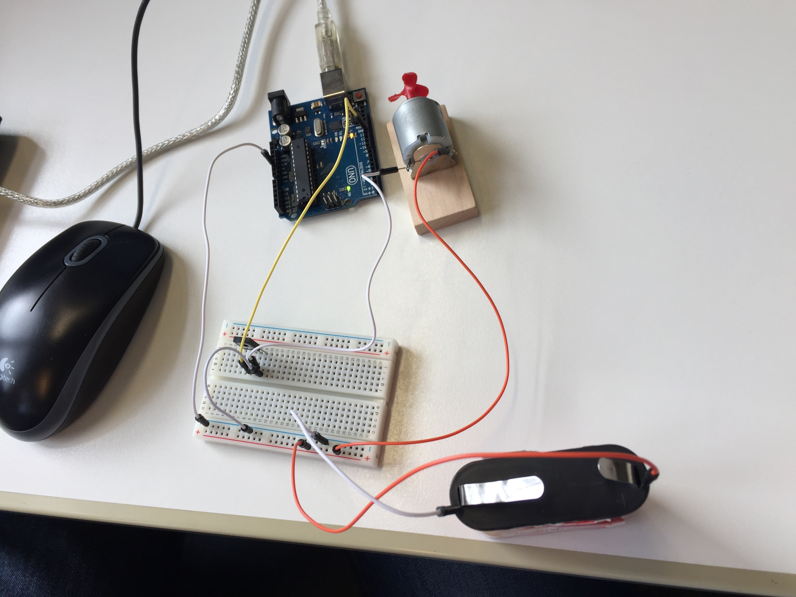
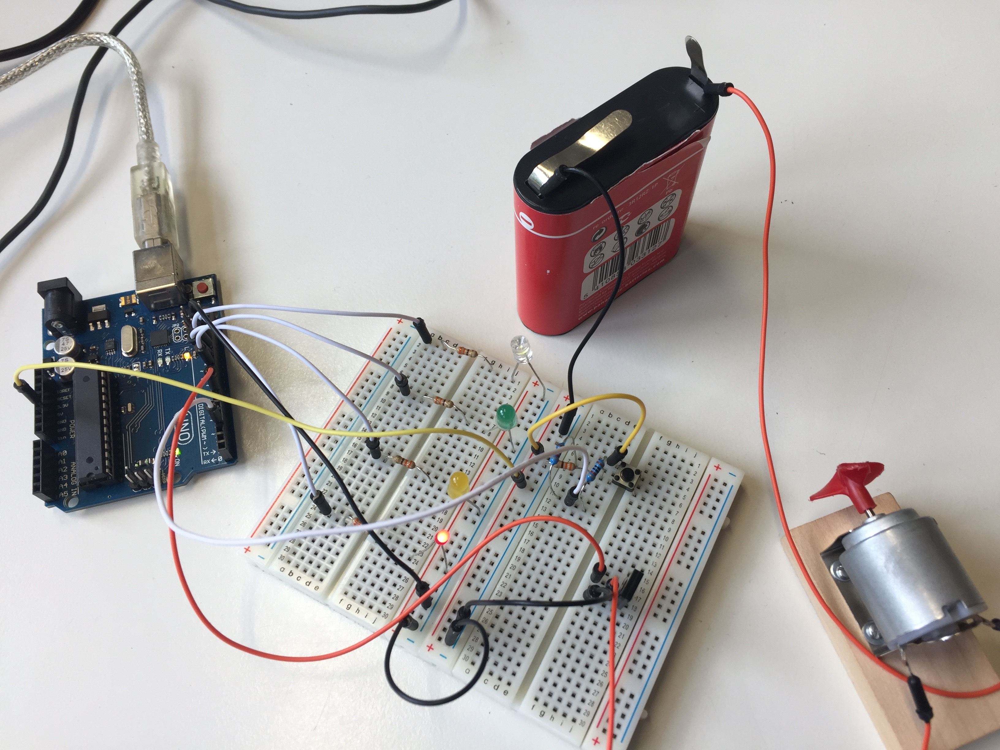
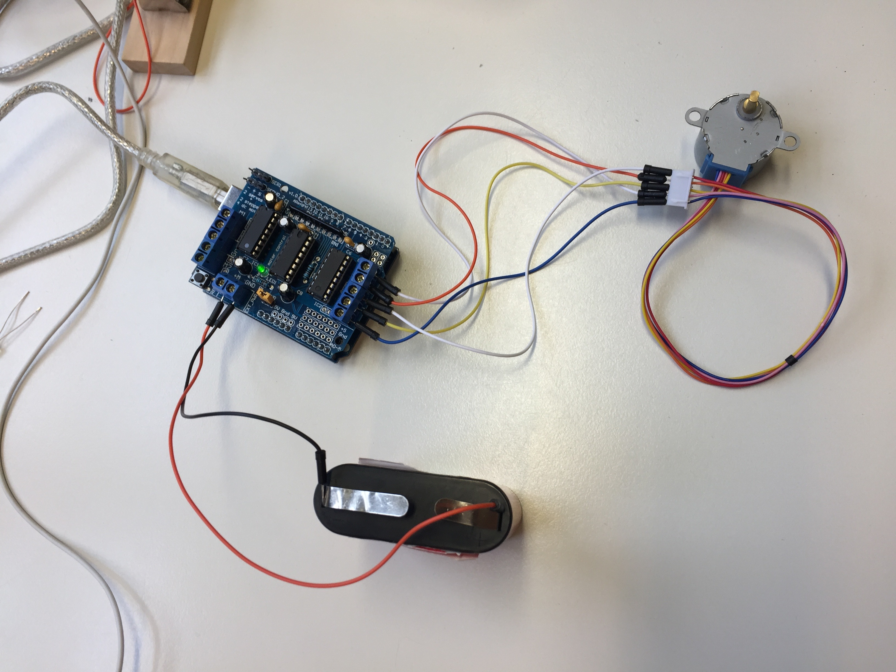
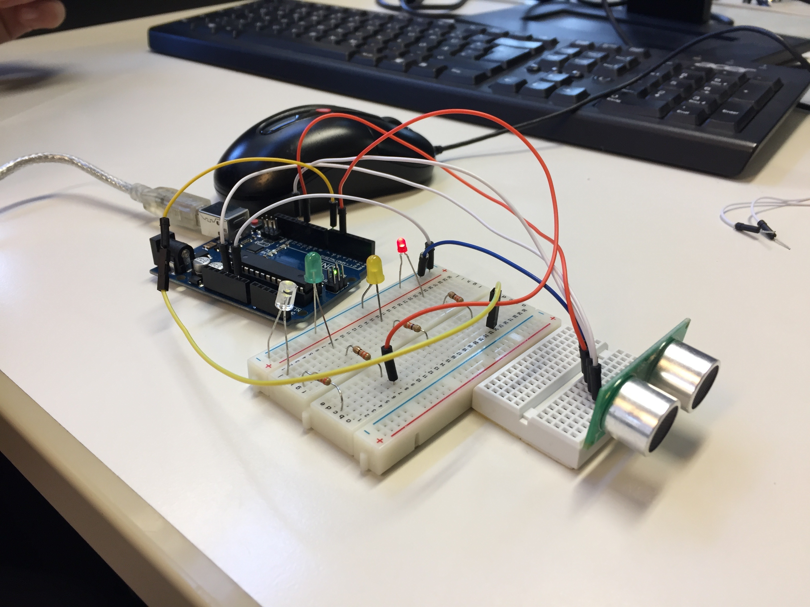
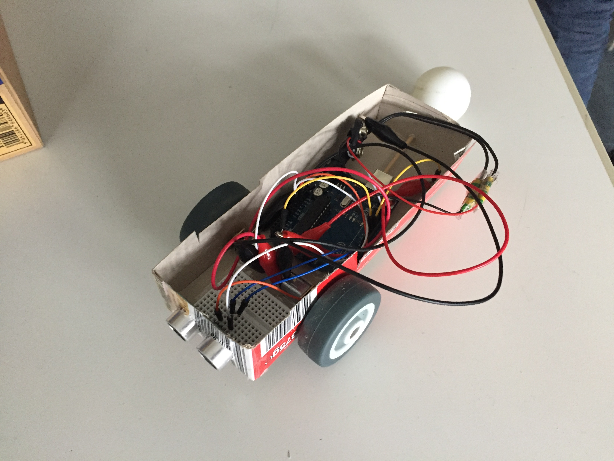

<h1>Arduino-Project</h1>
<ul>
<li><a href="#1">1. Einleitung</a></li>
<li><a href="#2">2. Die ersten Versuche mit LED's</a></li>
<li><a href="#3">3. Der Transistor</a></li>
<li><a href="#4">4. Die Windmaschinenampel</a></li>
<li><a href="#5">5. Der Motor</a></li>
<li><a href="#6">6. Der Ultraschallsensor</a></li>
<li><a href="#7">7. Fazit</a></li>
<li><a href="#8">8. Das Auto</a></li>
<li><a href="#9">9. Zeitliche Übersicht</a></li>
<li><a href="#10">10. Funktionale Fehler des Autos</a></li>
<li><a href="#11">11. Das Auto 1.5</a></li>
<li><a href="#12">12. Das Auto 2.0</a></li>
<li><a href="#13">13. Zeitliche Übersicht 2</a></li>
<li><a href="#14">14. Schlussfazit</a></li>
</ul>

<h3>
<a id="1">1. Einleitung</a>
</h3>

Zu Beginn der Unterrichtseinheit haben wir uns erst damit beschäftig, welches Projekt für uns geeignet ist. Dabei haben wir zum einen darauf geachtet, welches Projekt von dem Schwierigkeitsgrad zu uns passt. Zum anderen wollten wir ein Projekt beginnen, welches nicht nur fiktiv auf einem Bildschirm sichtbar ist, sondern real ist. Nach einer kurzen Rücksprache mit unserem Informatiklehrer sind wir schlussendlich auf den Arduino gekommen, da dieser genau zu unseren Kriterien passt. Unser Ziel ist es, am Ende unserer Projektreihe einen alleine Fahrenden Roboter zu programmieren und zu bauen. Dieser soll in einem abgesteckten Parkour ohne Einwirkungen von außen seinen Weg finden. Da unsere Informatikvorkenntnisse sehr begrenzt waren, haben wir uns am Anfang mit einfachen Schaltungen und Skripts auseinander gesetzt. Hierbei haben wir die verschiedenen Bauteile und Möglichkeiten des Arduino, welche für den Bau unseres Roboters notwendig sind, besser kennengelernt und deren Benutzung erlernt. Am Ende dieser Reihe ist es unser Ziel mit unseren neu erworbenen Fähigkeiten einen wie oben beschriebenen Roboter herzustellen. Folgend werden wir unsere Schritte hierzu genauer erläutern.

<h3>
<a id="2">2. Die ersten Versuche mit LED's</a>
</h3>

<a href="https://github.com/Stormarnschule12/Arduino-car/blob/master/sketch_Taster.ino">Sketch Taster</a>

Als erstes kleines Projekt haben wir eine einfache Ampel mit einem Knopf als Auslöser programmiert und aufgebaut. Zu Beginn brennt die grüne LED und die rote ist nicht in betrieb. Bei Benutzung der Taste geht die grüne LED aus und die rote LED beginnt zu leuchten. Nach einer in dem Skript fest definierten Zeit, wird dieser Vorgang revidiert und die LED's sind in ihrem Ausgangszustand. Dieser erste Aufbau hat es uns ermöglicht die Benutzung der Arduino Software zu erlernen. Zudem haben wir die Grundlegenden Formeln für die Programmierung kennengelernt.

<h3>
<a id="3">3. Der Transistor</a>
</h3>

<a href="https://github.com/Stormarnschule12/Arduino-car/blob/master/sketch_Transistor.ino">Sketch Transistor</a>

Der nächste Schritt beinhaltete, dass wir beide uns mit einem Motor auseinander gesetzt haben. Die Schaltung, sowie der Skript sind nicht besonders komplex, doch es ging uns in erster Linie darum, die Funktionalität eines Motors sowie die Energieversorgung durch eine Externe Stromquelle zu erlernen. Damit die Batterie, über den Arduino gesteuert, den Motor mit Energie versorgen kann, haben wir einen Transistor verbaut. Dieser ermöglicht bei einer anliegenden Potenzialdifferenz, welche vom Arduino ausgeht, dass der Masseanschluss von der Batterie zum Motor hergestellt wird. Bei Fehlender Spannung an dem Transistor wird die Verbindung unterbrochen und der Batterie-Motor-Stromkreislauf ist nicht mehr geschlossen. Das Skript haben wir so geschrieben, dass der Motor sich beginnt zu Drehen und nach einer bestimmten Zeit wieder stoppt. Zudem haben wir festgestellt, wenn man den Zeitlichen Abstand zwischen Drehen und Stopp sehr kurz hält, so scheint es als sei der Motor gedrosselt. Folglich erscheint es dem Menschen, als würde sich der Motor langsam drehen und nicht an und ausgehen.

<h3>
<a id="4">4. Die Windmaschienenampel</a>
</h3>

<a href="https://github.com/Stormarnschule12/Arduino-car/blob/master/sketch_Amepl.ino">Sketch Ampel</a>

Als 3. Miniprojekt wollten wir nun unsere Erkenntnisse und Erfolge aus den beiden vorangegangenen Aufbauten zu einem größeren und komplexeren zusammenfügen. Wir steckten also wie im vorangehenden Aufbau den Drehmotor mit Transistor zusammen, zusätzlich bauten wir auch noch vier LEDs und den Druckknopf in dem Aufbau zusammen. Unser Ziel war es, dass man von den LEDs den Betrieb des Motors ablesen kann. So leuchtet die grüne LED, wenn der Motor läuft. Bei drücken des Knopfes hört die LED auf zu leuchten, eine andere beginnt zu blinken, der Motor geht aus und die rote LED beginnt zu leuchten. Nach einer bestimmten Zeit geht die rote LED wieder aus, Grün leuchtet und der Motor dreht sich wieder. In diesem Zwischenschritt, konnten wir verschiedene Mechanismen mit einander zu verbinden.

<h3>
<a id="5">5. Der Motor</a>
</h3>

<a href="https://github.com/Stormarnschule12/Arduino-car/blob/master/sketch_Stepmotor.ino">Sketch Stepmotor</a>

In unserem nun folgenden Schritt beschäftigten wir uns mit dem Motorschild, einem Aufsteckmodul für den Arduino, dieser ermöglicht es, eine externe Stromquelle mit stärkerer Spannung direkt anzuschließen. Zusätzlich bietet das Modul Anschlussmöglichkeiten für zwei Drehmotoren, welche jeweils zwei positiv und negativ Anschlüsse brauchen. Wir fügten der Softwarelibaire einen Ordner hinzu, welcher die Befehlsbasis des Arduino erweitert um die einfache Programmierung des Arduinos ermöglicht. Nach Aufbau und Programmierung führten wir das Programm mit verschiedenen Schrittweiten und Geschwindigkeiten aus.

<h3>
<a id="6">6. Der Ultraschallsensor</a>
</h3>

<a href="https://github.com/Stormarnschule12/Arduino-car/blob/master/sketch_Ultraschallsensor_mit_LED.ino">Sketch Ultraschallsensor</a>

In unserem, bis zu diesem Zeitpunkt, letzten Aufbau beschäftigten wir uns mit dem, für unseren selbstfahrenden Roboter, unerlässlichem Steuerelement. Dem Ultraschallsensor. Im Vorfeld dieses Schrittes mussten wir uns mehr einlesen, da dies, dass bis jetzt komplizierteste Element war. Bei der Arbeit mit ihm, muss man nämlich auch den Umgang mit Variablen und einige rechnerische Elemente beachten. Nach einer gewissen Einlesezeit begannen wir. Der Sensor sendet ein Signal aus, das von einem Objekt zurückgeworfen wird, auf das es trifft. Der dann eingehende Impuls ist erstmal für den Code nicht zu verarbeiten. Die Zeit zwischen aussenden und empfangen wird gemessen. Die Zeit wird durch die Schallgeschwindigkeit geteilt, um ein Distanz heraus zu bekommen. Darauffolgend wird diese durch 2 geteilt, da man nur die Streck in eine Richtung haben möchte. Wir schrieben den Code so, dass in einem definierten Bereich vor dem Sensor eine grüne LED leuchtet, ist das Objekt zu dicht vor dem Sensor wechselt das Licht von grün auf rot.

<h3>
<a id="7">7. Fazit</a>
</h3>

Abschließend würden wir selbsteinschätzend sagen, dass wir bis zum jetzigen Punkt gute Fortschritte gemacht haben und insbesondere in der Arbeit mit Programmierung viele neue Kenntnisse gesammelt haben. Wir sind mir der Wahl unseres Projektes immer noch sehr zufrieden und motiviert unser finales Ziel zu erreichen. Unsere Zusammenarbeit hat sehr gut funktioniert und in den Aufgaben haben wir regelmäßig gewechselt, so dass beide einen gleichen Anteil am Projekt haben.

<h3>
<a id="8">8.Das Auto</a>
</h3>

<a href="https://github.com/Stormarnschule12/Arduino-car/blob/master/sketch_Ultraschallsensor_mit_Motor.ino">Sketch Auto</a>

Alles momentanes Ende unseres Projektes mit dem Arduino stellten wir in den letzten Stunden unser Auto fertig. Der Code hierfür besteht aus zwei Teilen. 
1. Der Auslesung des Ultraschallsensors 
Und 2. Der Steuerung für die beiden Elektromotoren 
Für die Auslesung wird die Zeit zwischen Aussenden und Empfangen gemessen, durch die Schallgeschwindigkeit und durch zwei geteilt, so wird die Distanz errechnet. 
Über einen Ultraschallsensor kann nur ein Wert und auch nur einer der beiden Motoren angesteuert werden. Heißt, ein Motor läuft immer und er auf der anderen Seite stoppt, wenn von dem Sensor ein Hindernis vor dem Auto gemessen wird. Das Auto kann sich also immer nur in eine Richtung drehen. 
Damit das Auto nicht mit den Reifen, welche breiter als die Front des Autos mit dem Sensor sind, gegen ein Hindernis stößt, programmierten wir noch eine Unterbrechung ein, nachdem ein Hindernis gemessen wurde, damit diesem vollständig ausgewichen wird. 
Zum Ende der letzten Stunde war unser Auto theoretisch in der Lage selbständig zu fahren, es gibt nur noch ein Traktionsproblem, da die Räder nicht sehr fest auf den Achsen sitzen. Ebenfalls wegen der Räder müsste das Chassi strukturell noch verstärkt werden. 
Ein anfängliches Problem mit der großen Reibung beim Lenken lösten wir durch einen reibungsarmen Tischtennisball anstelle eines Hinterrades.

<h3>
<a id="9">9.Zeitliche Übersicht</a>
</h3>

<table>
<thead>
<tr>
<th>Datum</th>
<th align="center">Aktivität</th>
</tr>
</thead>
<tbody>
<tr>
<td>Montag, 05.12.16</td>
<td align="center">Wiedereinfindung in die Materie und unser Projekt</td>
</tr>
<tr>
<td>Montag, 12.12.16</td>
<td align="center">Aufstellen einer Liste, welche Sachen wir für unser Auto noch erledigen müssen</td>
</tr>
<tr>
<td>Montag, 16.01.17</td>
<td align="center">Überlegungen zur praktischen Fertigstellung unseres Halbjahresprojektes</td>
</tr>
<tr>
<td>Donnerstag, 23.01.17</td>
<td align="center">Selbstständiges Einlesen in die Grundlagen von Github-Pages</td>
</tr>
<tr>
<td>Dienstag, 07.02.17</td>
<td align="center">Vortrag von Stefan zu html Grundlagen für GitHub-Pages</td>
</tr>
<tr>
<td>Donnerstag, 09.02.17</td>
<td align="center">Beginn der "Bauarbeiten" an unserem Auto</td>
</tr>
<tr>
<td>Dienstag, 14.02.17</td>
<td align="center">Fertigstellung und erste Korrekturen an unserem Auto und Code</td>
</tr>
<tr>
<td>Donnerstag, 16.02.17</td>
<td align="center">"Feinschliff" an dem Auto und Code</td>
</tr>
</tbody>
</table>

<h3>
<a id="10">10. Funktionale Fehler des Autos</a>
</h3>

Aus dem Aufbau unseres Autos resultiert, dass das Auto nur in eine Richtung ausweichen kann, da der Code so funktioniert, dass bei einem Hindernis ein Motor weiter vorwärts dreht und der andere stoppt. Somit kann es passieren, dass sich das Auto in Hindernisse schräg links von ihm festfährt. Ein Detailproblem, welches die grundlegende Funktion des Autos nicht beeinträchtigt, ist, dass die Reifen nicht perfekt auf den Achsen sitzen, was zu Energieverlust führt. Außerdem haben die Reifen auf staubigem oder dreckigem Boden nach kurzer Zeit Grip-Probleme.  

<h3>
<a id="11">11. Das Auto 1.5</a>
</h3>

Um das Problem des Festfahrens zu lösen, wollten wir das Auto, wenn es ein Hindernis erkennt, erst einmal zurücksetzt. Dafür müssen die Motoren umgepolt werden.  
Durch eine Neuverkabelung der Motoren, können diese an beiden Anschlüssen mit Strom versorgt und an beiden geerdet werden, dies ermöglicht eine Drehung in beide Richtungen. 
Dies wird durch den Einsatz von Wiederständen ermöglicht. Jeder Pol eines Motors ist durch einen Wiederstand mit dem Plus sowie dem Minuspol verbunden. Des Weiteren ist jeder Pol auch mit einem Pin des Arduino verbunden. Die Rückwärtsfahrt wird ermöglicht, wenn der eine Pin des Motors eingeschaltet ist und der Andere aus, dann hat der Motor zum einen durch den Wiederstand auf dem abgeschalteten pol eine Verbindung zur Erdung und zum anderen eine Verbindung zu einem Pluspol durch den Eingeschalteten Pin. Die Verbindung zum 5V Anschluss des Arduinos mit einem Wiederstand sorgt zudem dafür, dass den Motor eine erhöhte Leistung erhält. Die Vorwärtsfahrt wird durch eine Umpolung der beiden Pins ermöglicht. 
Durch das Zusammenspiel beider Motoren kann der Roboter, wenn ein Hindernis erkannt wird, nun erst zurücksetzen und dann drehen. Dadurch fährt er sich nicht mehr so leicht fest. 
Durch die Neuverkabelung ergibt sich allerdings ein neues Problem. Durch die höheren wiederstände kommt weniger Strom an den Motoren an, in Verbindung mit den in <a href="#10">10.</a> genannten Traktionsproblemen führte das Teilweise zu Leistungsproblemen, also das das Auto sich nur mit einem Anstoß weiter bewegen kann.  

<h3>
<a id="12">12. Das Auto 2.0</a>
</h3>

Um die Leistung der beiden Motoren zu erhöhen haben wir uns überlegt wie wir mehr Spannung ausgeben können. 
Da der Arduino über die Pins nur bis zu 5v ausgeben kann und wir über unsere Schaltung, die das Umpolen ermöglicht, die Leistung über mehrere Wiederstände weiter reduzieren mussten, mussten wir die Grundspannung erhöhen. Hierzu bedienten wir uns an Transistoren, wie wir es schon in <a href="#3">Der Transistor</a> gemacht hatten. Mit den Transistoren konnten wir bei einem Auto, das nur vorwärts fährt und in zwei Richtungen ausweichen kann gute Ergebnisse erzielen. Das Auto fuhr schneller und fuhr die kurven ohne Probleme nehmen konnte.  
Problematisch war aber, die Schaltung, die das Umpolen der Motoren und somit das zurücksetzen des Autos ermöglichte, auf die Transistoren anzuwenden.  
Da bei der Verwendung eines Transistors der Pin, welchen man über den Arduino ansteuert, nur den Stromfluss durch den Transistor ermöglicht und nicht somit nicht direkt mit dem Motor verbunden ist, ist es uns nicht gelungen eine Schaltung aufzubauen, welche beide Anschlüsse des Motors sowohl mit Strom zu versorgen, als auch zu erden.

<h3>
<a id="13">13. Zeitliche Übersicht 2</a>
</h3>
<table>
<thead>
<tr>
<th>Datum</th>
<th align="center">Aktivität</th>
</tr>
</thead>
<tbody>
<tr>
<td>Dienstag, 21.02.17</td>
<td align="center">Abgabe Zwischenergebnisse</td>
</tr>
<tr>
<td>Donnerstag, 23.02.17</td>
<td align="center">Nachdem wir unser Projekt abgegeben haben, haben wir uns sehr ausführlich überlegt, wie wir unseren Roboter verbesser können. Ein sehr großes Problem war, dass die Geschwindigkeit viel zu langsam ist. So sind wir schlussendlich zu dem Ergebniss gekommen, dass wir unser Fahrzeug schneller machen müssen.</td>
</tr>
<tr>
<td>Mittwoch, 01.03.17</td>
<td align="center">Wir können wir unser Fharzeug Leistungsstärker machen? Die Lösung sind wie beim Auto 2.0 erläuterte Transistoren. Am heutigen Tag haben wir uns Überlegt, wie wir eine solche Schaltung zusammenstecken können, sodass diese Funktioniert.</td>
</tr>
<tr>
<td>Donnerstag, 02.03.17</td>
<td align="center">Nachdem Wir am Mittwoch erste Ideen gefunden hatten, um eine Schaltung zusammenzustecken, haben wir unseren Ideen auf dem Steckbrett zusammen gebaut und ausprobiert. Zudem haben wir auch versucht mit änderungen in dem Code die schaltung zum laufen zu bringen. Leider ohne  Erfolg, da wir immer noch die Rückwärtsfahrt ermöglichen wollten.</td>
</tr>
<tr>
<td>Mittwoch, 08.03.17</td>
<td align="center">Nachdem wir realisiert hatten, dass wir es mit unseren Kenntnissen nicht zu einem Erfolg mit den Transistoren bringen konnten, haben wir uns darauf verständigt, die Funktionen Einzuschränken, sodass unser Roboter nur noch vorwährts fahren kann. Wie bei 8. Hierfür haben wir uns schlussendlich in dieser Stunde gedangen und erste Versuche hierzu gemacht.</td>
</tr>
<tr>
<td>Donnerstag, 09.03.17</td>
<td align="center">Mit unseren Ideen von der vorherigen Stunde haben wir heute erste Versuche und verbesserungen für unser <a href="#12">Auto 2.0</a> gemacht. Leider fehlte uns zum Ende der Stunde ein wenig die Zeit unser Ergebniss Auszuprobieren.</td>
</tr>
<tr>
<td>Dienstag, 14.03.17</td>
<td align="center">Nach unseren Erfolgreichen Tests von der Vorherigen Woche, könnten wir heute ein, in unseren Augen, sehr schnelles <a href="#12">Auto 2.0</a> auf die Beine stellen. Dieses hat auch sehr erfolgreich funktioniert</td>
</tr>
<tr>
<td>Donnerstag, 16.03.17</td>
<td align="center">Nach einem Zufrieden stellenden Projektabschlusses, haben wir uns heute daran gemacht unsere Github-Seite zu gestallten.</td>
</tr>
<tr>
<td>Dienstag, 21.03.17</td>
<td align="center">Am Dienstag hat uns im Informatik-Unterricht unsere Schulleiterin Frau Dr. Witte besucht. Ihr haben wir in allen einzelheiten erklärt, zu welchem Ziel wir in unsere Informatikprojektarbeit gekommen sind. Hierfür haben wir unser Auto zuerst zusammen bauen müssen, damit wir unser Schulleiterin unser PRojekt präsentieren konnten</td>
</tr>
</tbody>
</table>

<h3>
<a id="14">14. Schlussfazit</a>
</h3>

Abschließend können wir über unser Schuljahr Informatik sagen, dass wir unser persönliches Ziel erreicht haben.   
Wir haben ein selbstfahrendes Auto entwickelt, dass Hindernissen ausweichen kann. 
Am Unterricht in Informatik hat uns gut gefallen, dass… 
<ul>
<li>…Wir eine freie Themenwahl hatten und in unserem eigenen Tempo arbeiten konnten </li>
<li>…Unsere eigenen Zwischenziele setzen konnten und in der Gestaltung unserer Ergebnisse frei waren  </li>
<li>…wir am Ende des Schuljahres ein Projekt abgeben konnten, in dem wir unsere Ziele erreicht haben, mit dem wir zufrieden sind und in dem wir uns selbst verwirklichen konnten.</li>
<li>Wir neues gelernt haben, von dem wir vorher noch sehr wenig bis garkeine Kentnisse hatten</li>
</ul>

Für nächstes Mal würden wir uns wünschen, dass... 
<ul>
<li>…wir in den ersten Stunden einen gemeinsamen Einstieg haben, in dem Grundlagen gemeinsam erlernt werden</li>
<li>…es leichter wäre Programme auf den Rechnern zu instalieren, da wir öfter auf Hilfe warrten mussten um die Arduino sowfware zu instalieren, da dies mit unseren Rechen nicht möglich war.</li>
</ul> 

<a href="#Anf">Zum Seitenanfang</a>
